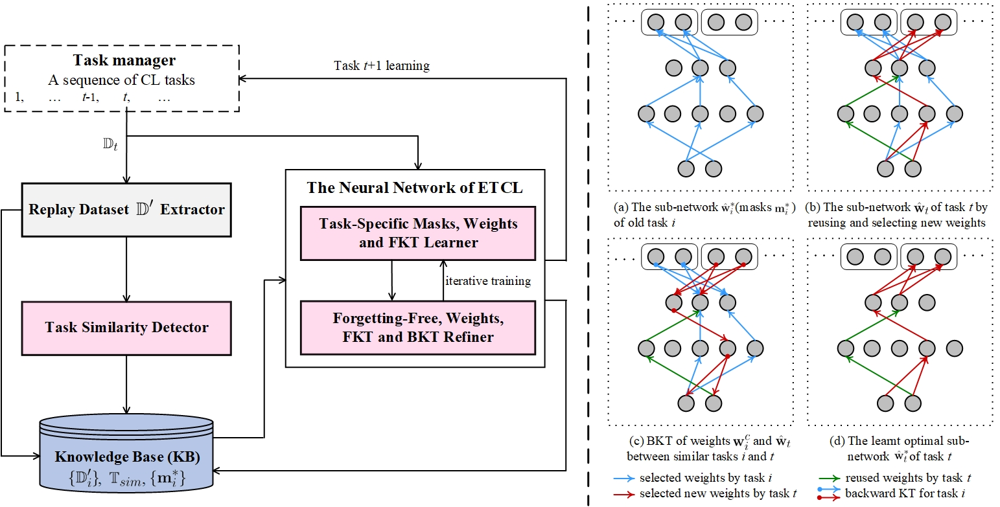

# A Versatile Mask Achieving Forgetting-free and Positive Knowledge Transfer

## Abstract

Existing research on continual learning (CL) of a sequence of tasks mainly focused on dealing with catastrophic forgetting (CF), where the tasks are assumed to be dissimilar and have little shared knowledge. However, an ideal CL agent should not only be able to overcome CF, but also to encourage positive forward and backward knowledge transfer (KT), i.e., using the learned knowledge from previous tasks for the new task learning (namely FKT), and improving the previous tasks performance with the knowledge of the new task (namely BKT). To this end, this paper proposes a novel Enhanced Task Continual Learning (ETCL) method: a versatile masking mechanism that achieves forgetting-free and positive KT. Specifically, the paper first theoretically studies the KT problem and gives the bounds that can lead to negative FKT and BKT. A new criterion for detecting similar tasks is also proposed. In training, while learning a task, ETCL learns a set of task-specific binary masks to isolate a sub-network for the task, by which ETCL protects the learned tasks to overcome CF. At the beginning of a new task learning, ETCL tries to align the new task gradient with that of the sub-network of the previous most similar task to ensure strong positive FKT. By using a new bi-objective optimization and an orthogonal gradient projection method, ETCL updates only the weights of previous similar tasks at the classification layer to achieve positive BKT. Extensive evaluations demonstrate that ETCL significantly outperforms strong baselines on dissimilar, similar and mixed task sequences. 



The architecture and pipeline of the proposed ETCL (on the left), where the proposed new techniques are embedded in the pink  components. To the right of the dotted line separation, let $i$ and $t$ be two tasks similar to each other ($i<t$). (a) The selected sub-network $\hat{\mathbf{w}}_i^*$ (indicated by masks $\mathbf{m}^*_{i}$) of the previous task $i$ represented with blue arrows. (b) The selected initial sub-network $\hat{\mathbf{w}}_t$ (masks $\mathbf{m}_{t}$) of task $t$ represented by the selected new or unused weights by previous tasks (red arrows) and reused weights of previous similar task $i$ (green arrows) leading to automatic forward KT. (c) During task $t$ training, the weights corresponding to $\mathbf{m}_{t}$ are constantly updated and optimized. With the bi-objective optimization of the classification layer, the knowledge from task $t$ is backward transferred to previous task $i$ (those arrows with a circular point at the tails). (d) The optimized sub-network $\hat{\mathbf{w}}_t^*$ (masks $\mathbf{m}^*_{t}$) of task $t$ with newly selected and reused weights.

## Environments

```bash
conda create -n [your_env_name] python=3.9
conda activate [your_env_name]
pip install -r requirements.txt
```

## Training and Testing

In the following, we show how to train and test the proposed method SATCL on eleven different datasets for continual learning.

### PMNIST

```bash
python main_pmini.py
```

### CIFAR-100

```bash
python main_cifar100.py
```

### CIFAR-100 Superclass

```bash
python main_cifar100_sup.py
```

### MiniImageNet

```bash
python main_mini_imagenet.py
```

### Five-Datasets

```bash
python main_five_datasets.py
```

### F-EMNIST-1

```bash
python main_femnist10.py
```

### F-EMNIST-2

```bash
python main_femnist35.py
```

### F-CelebA-1

```bash
python main_celeba10.py
```

### F-CelebA-2

```bash
python main_celeba20.py
```

### (EMNIST, F-EMNIST-1)

```bash
python main_mixemnist.py
```

### (CIFAR 100, F-CelebA-1)

```bash
python main_mixceleba.py
```


The parameter settings can be modified in each 'main_*.py' file. You can view the parameter descriptions in each file. The continual learning results will be printed on the terminal.

## Datasets
The data files are not included in the repository because they are too large. When you run the 'main_*.py' files, they will automatically download the data files from the internet and save them in this directory.

Note that, F-CelebA should be downloaded from [CelebA](http://mmlab.ie.cuhk.edu.hk/projects/CelebA.html) and follow the instruction  of [Leaf](https://github.com/TalwalkarLab/leaf).  Processed files are in **./data** folder

